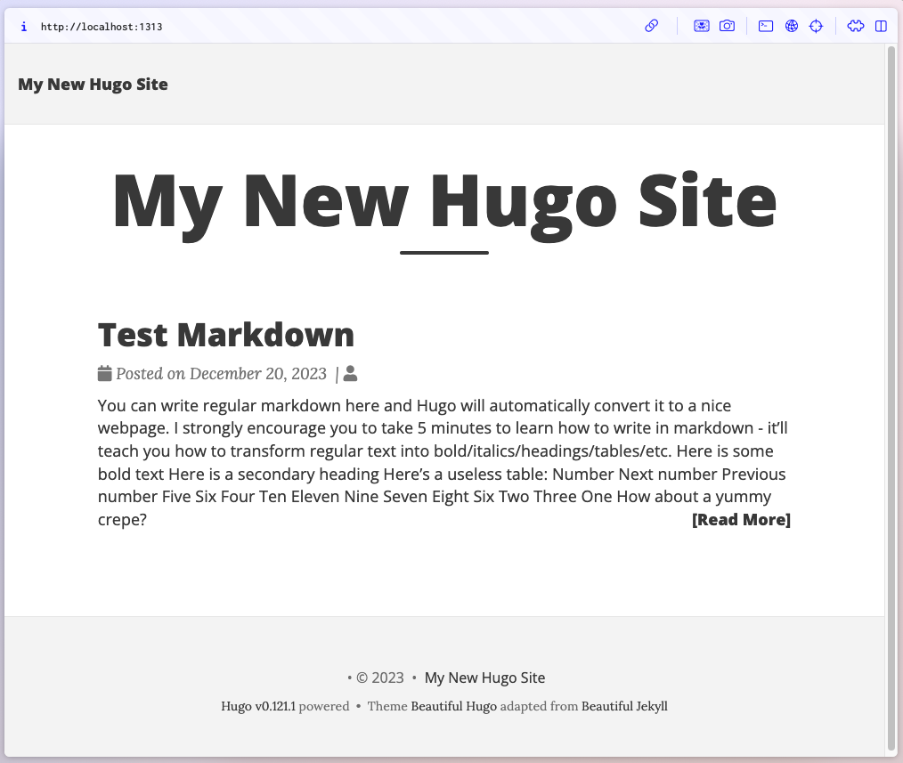

Are you bored of the same old Christmas traditions? Do you want to spice up your holiday season with some geeky fun? If so, you might want to try learning about Hugo and creating and deploying your first Hugo site to GitHub Pages!

In this blog post, I will show you how to set up Hugo on your computer, create a new site, add some content, and deploy it to GitHub Pages. It's easier than you think and you'll have a lot of fun along the way. Let's get started!

## Prerequisites

- [Git](https://git-scm.com/)
- [GitHub Account](https://github.com/)
- [GitHub CLI](https://cli.github.com/)
- Basic knowledge of working in Linux shell
- Basic [Markdown](https://www.markdownguide.org/) knowledge
- Basic knowledge of DNS domain registration and administration.

## Getting Started with Hugo

### What is Hugo?

Hugo is a fast and easy-to-use static site generator that lets you create beautiful websites without any coding. You can use one of the many themes available or customize your own. Hugo also supports markdown, so you can write your content in a simple and intuitive way.

### Why Choose Hugo?

Hugo is known for its speed and flexibility. It's a great choice for building anything from personal blogs to full-fledged websites.

### Installing Hugo

To get started, you'll need to install Hugo on your computer.

To install Hugo on macOS, from your terminal run the following command:

```shell
brew install hugo
```

If you don't have brew installed on your Mac, then check out the [Homebrew Site](https://brew.sh/) for instructions.

To install Hugo on Windows or Linux, reference the [official installation instructions](https://gohugo.io/getting-started/installing/)

## Create Your First Hugo Site

Once Hugo is installed, you can create your first site. This involves initializing a new Hugo project and exploring its structure. Hugo's documentation offers clear steps to get you started.

Within the terminal session, navigate to the directory where you want to create your Hugo site.  The examples in this post will use `$HOME/Development/hugoDev` as the parent folder where we will create the site.

Create a new Hugo site.  The example in this post will use **myhugoblog** for the Hugo site name.

```shell
hugo new site myhugoblog
```


Within the terminal session switch into the directory of the newly created site


### Create a Git Repository

Set up the site's directory as a Git repository.

```shell
git init
```


Add a `.gitignore` file:

```shell
echo -e ".DS_Store\n.hugo_build.lock" > .gitignore
```

## Hugo Project Themes

Themes are an integral part of Hugo. They define your site’s look and feel. Hugo does not come with a default theme, so you will download one and install it within your site.  Hugo has many available options to chose from a theme perspective.  Take a look at [https://themes.gohugo.io](https://themes.gohugo.io) and pick one that think would work well for you and your site.  In this post will configure the [Beautiful Hugo](https://themes.gohugo.io/themes/beautifulhugo/) theme.

There are many different ways that a theme can be added into your site configuration.  Review the documentation for the theme you select for details on how to add the theme.  For the purposes of this example the Hugo modules method will be used to add the Beautiful Hugo theme to the site.

### Initialize The Project As A Hugo Module

It is first necessary to initialize our current Hugo project as a Hugo Module.

Initialize a new Hugo module. This initialization creates a `go.mod` file in the root of the site. The `go.mod` file tracks the dependencies of the site and the version of Go that the site uses. Hugo and GitHub Actions use the version of Go when building the site.

```shell
hugo mod init github.com/toddwalters/myhugoblog
```


Remove the Go patch version from the `go.mod` file. This modification is required because GitHub Actions only supports Go specified in Major.Minor format. GitHub Actions builds and deploys the site to GitHub pages and fails if the `go.mod` file includes the patch version. For more information about Semantic versioning, see [semver.org](https://semver.org/).

```shell
sed -i '' 's/\(go [0-9]*\.[0-9]*\)\.[0-9]*/\1/' go.mod
```


For more details about `hugo mod init` reference the [Hugo Documentation](https://gohugo.io/commands/hugo_mod_init/)

### Add Theme To Hugo Project

Now that the project has been initialized as a Hugo Module a theme can be added to the site using the `hugo mod get` command.  As mentioned previously in this example the [Beautiful Hugo Theme](https://github.com/halogenica/beautifulhugo) will be used.


Configure the site to use the Beautiful Hugo theme:

```shell
echo -e "[[module.imports]]\npath = 'github.com/halogenica/beautifulhugo'" >> hugo.toml
```


## Creating Content

A blog site with no blog posts is pretty boring, so let's create some content so there is something to see.  

The content files within Hugo are written in [Markdown](https://markdowntutorial.com/). Markdown is a simple markup language used to format text for the web. It employs plain text to create structured documents, easily converting into HTML. Markdown is favored for its straightforward syntax and readability.

Markdown can include metadata, typically through a section known as "**Front Matter**" at the beginning of the document. Front Matter is used to hold structured data, like title, date, author, and other custom information about the document.  

See the documenation for the specific theme to understand what metadata is supported by the theme.

### Create A Test Post

In order to verify that the site is function as expected after intial install and configuration create a new post using the `hugo new content` command.  In the example below a post called `test-markdown.md` will be created in the `/content/posts` folder.

```shell
hugo new content posts/test-markdown.md
```


By default when creating content using the `hugo new content` command the following metadata is included in the Front Matter section of the document:  ***title***, ***date***, and ***draft***.

Replace all of the default content within the `test-markdown.md` file, including the default Front Matter metadata section, with the content in the text below.

```markdown
---
title: Test Markdown
subtitle: Each post also has a subtitle
date: 2023-12-20
---
You can write regular [markdown](https://markdowntutorial.com/) here and [Hugo](https://gohugo.io) will automatically convert it to a nice webpage.  I strongly encourage you to [take 5 minutes to learn how to write in markdown](https://markdowntutorial.com/) - it'll teach you how to transform regular text into bold/italics/headings/tables/etc.

**Here is some bold text**

## Here is a secondary heading

Here's a useless table:
 
| Number | Next number | Previous number |
| :------ |:--- | :--- |
| Five | Six | Four |
| Ten | Eleven | Nine |
| Seven | Eight | Six |
| Two | Three | One |
```

### Test The Site Locally

It is always good to test the site locally in order to make sure that the site w before we publish it to the world.  Luckily Hugo makes this easy for us via the `hugo server` command.

This command starts up a local web server and serves your site, allowing you to preview changes in real-time as you develop. It's a development tool that makes it easy to test and view your site locally before deploying it to a production environment. The server automatically reloads the page when you make changes to the site's content or configuration, providing an efficient workflow for website development and design.


Once the local web server starts up you can view the locally rendered site by going to [http://localhost:1313/](http://localhost:1313/) in your preferred web browser.

You should see a page displayed that looks similar to the page below.



After you have verified that the Hugo site is running successfully locally, go ahead and stop the local web server by pressing ***CTRL+C*** in the terminal window where you started the server.

## Deploying Your Site on GitHub Pages

### What is GitHub Pages
GitHub Pages is a free service that lets you host your website directly from your GitHub repository. You can use your own domain name or a subdomain of github.io. GitHub Pages also supports HTTPS, so you can secure your site with encryption.  Additionally you can leverage a custom domain name with your site.

### Create A GitHub Repository
GitHub Pages allows you to host your site directly from a GitHub repository.

Let's get our example repo associated with our Hugo site ready to be added to a GitHub repository.  First let's add and commit the changes we have made thus far to our local git repository.

```shell
git add .
git commit -m 'Initial commit'
```


> **_NOTE:_**  If you have not already authenticated to GitHub in the CLI, you will need to do so before you proceed.  Run the following command to login:  
> `gh auth login`

Now lets create a GitHub repository and push the contents of our local git repo to the GiHub repository.  In order to use GitHub Pages to host your Hugo site the GitHub repo must be a public repo.

```shell
gh repo create myhugoblog --public --push --source=. --description 'My hugo blog site'
```


### Deploy To GitHub Pages

The [Host on GitHub Pages](https://gohugo.io/hosting-and-deployment/hosting-on-github/) section of the Hugo site describes how to set-up a GitHub repo to deploy a Hugo site onto GitHub Pages and how to configure and enable a GitHub Actions workflow to build and deploy the site everytime there is a commit to the main branch.

Those instructions assume you want to implement those changes directly on the GitHub site. I however am a big fan of doing things via the CLI. Blame the years I spent as a Linux Server Admin.  In this example I will be showing you how to enable all of this via the CLI.

#### Configure Repo To Be Used With GitHub Pages
First things first, lets deploy our site to GitHub Pages by using the GitHub CLI to interact with the GitHub API to update the the repo settings to enable GitHub Pages.

```shell
gh api -H "Accept: application/vnd.github+json" -H "X-GitHub-Api-Version: 2022-11-28" /repos/<github-username>/myhugoblog/pages -F "source:branch=main" -F "source:path=/" -F "build_type=workflow"
```

> **NOTE:** replace \<github-username>  with your github username.


#### Configure GitHub Actions Within The Repo

Create the GitHub Actions workflow folder with our local copy of the GitHub repo.

```shell
mkdir -p .github/workflows
```

Save the following GitHub Actions workflow to a file named `hugo.yaml` in the workflow folder. Run `hugo version` on your computer to determine what version of Hugo you're using and update the version in the workflow file. The following workflow is the same version of the one found in the [Host on GitHub Pages](https://gohugo.io/hosting-and-deployment/hosting-on-github/) section of the Hugo website. 

> **NOTE:** Always check the Hugo site to see if they have updated the workflow script.  The text below is current as of the original publish date of this article. 

```shell
# Sample workflow for building and deploying a Hugo site to GitHub Pages
name: Deploy Hugo site to Pages

on:
  # Runs on pushes targeting the default branch
  push:
    branches:
      - main

  # Allows you to run this workflow manually from the Actions tab
  workflow_dispatch:

# Sets permissions of the GITHUB_TOKEN to allow deployment to GitHub Pages
permissions:
  contents: read
  pages: write
  id-token: write

# Allow only one concurrent deployment, skipping runs queued between the run in-progress and latest queued.
# However, do NOT cancel in-progress runs as we want to allow these production deployments to complete.
concurrency:
  group: "pages"
  cancel-in-progress: false

# Default to bash
defaults:
  run:
    shell: bash

jobs:
  # Build job
  build:
    runs-on: ubuntu-latest
    env:
      HUGO_VERSION: 0.121.0
    steps:
      - name: Install Hugo CLI
        run: |
          wget -O ${{ runner.temp }}/hugo.deb https://github.com/gohugoio/hugo/releases/download/v${HUGO_VERSION}/hugo_extended_${HUGO_VERSION}_linux-amd64.deb \
          && sudo dpkg -i ${{ runner.temp }}/hugo.deb          
      - name: Install Dart Sass
        run: sudo snap install dart-sass
      - name: Checkout
        uses: actions/checkout@v4
        with:
          submodules: recursive
          fetch-depth: 0
      - name: Setup Pages
        id: pages
        uses: actions/configure-pages@v4
      - name: Install Node.js dependencies
        run: "[[ -f package-lock.json || -f npm-shrinkwrap.json ]] && npm ci || true"
      - name: Build with Hugo
        env:
          # For maximum backward compatibility with Hugo modules
          HUGO_ENVIRONMENT: production
          HUGO_ENV: production
        run: |
          hugo \
            --gc \
            --minify \
            --baseURL "${{ steps.pages.outputs.base_url }}/"          
      - name: Upload artifact
        uses: actions/upload-pages-artifact@v2
        with:
          path: ./public

  # Deployment job
  deploy:
    environment:
      name: github-pages
      url: ${{ steps.deployment.outputs.page_url }}
    runs-on: ubuntu-latest
    needs: build
    steps:
      - name: Deploy to GitHub Pages
        id: deployment
        uses: actions/deploy-pages@v3
```

Add, commit, and push the changes from our local copy of the repo up to the remote copy in Github.

```shell
git add .
git commit -m 'Adding GitHub Action Workflow'
git push
```


Pushing the changes to the main branch of your GitHub repo triggers the GitHub Actions workflow. The GitHub Action is a build-and-deploy workflow that builds and deploys the site to GitHub Pages. The GitHub Actions workflow automatically runs when you update the main branch, and you can manually trigger it by running:

 `gh workflow run 'Deploy Hugo site to Pages'`

 You can see the name of all your GitHub Actions workflows using the GitHub CLI.

 `gh workflow list`


Additionally, you can check the status of the GitHub Actions workflow from the CLI as well.

`gh workflow view 'Deploy Hugo site to Pages'`


Once the workflow has finished a successful run you should be able to go to the website by visiting the GitHub Pages URL for your site in the browser of your choice.

```shell
edge https://<github-username>.github.io/myhugoblog
```

You should see a website that looks exactly like the local verion that you previewed earlier.


#### Add a Custom URL

Assuming you are the owner of an DNS domain name you can configure your GitHub Pages site to use that domain as a Custom Domain associated with the GitHub Pages site.  Within this article I won't be covering the procurement and administration of a DNS domain and will assume that you have one and can update it as required.  GitHub has a detailed walk-through of how to associate a DNS domain to your GitHub user on the [Verifying your custom domain for GitHub Pages](https://docs.github.com/en/pages/configuring-a-custom-domain-for-your-github-pages-site/verifying-your-custom-domain-for-github-pages) documentation site.

After you have successfully verfied your ownership of the DNS domain. You will need to add DNS records to your DNS Domain. As part of the example used in this article we will assume that you are the owner of the `junk4walters.net` DNS Domain and that you want to associate your Apex Domain Name - `junk4walters.net` and a www subdomain - `www.junk4walters.net` to your GitHub Pages based Hugo site.  GitHub has another set of great detailed instructions covering both [Configuring an apex domain](https://docs.github.com/en/pages/configuring-a-custom-domain-for-your-github-pages-site/managing-a-custom-domain-for-your-github-pages-site#configuring-an-apex-domain) and [Configuring the www subdomain](https://docs.github.com/en/pages/configuring-a-custom-domain-for-your-github-pages-site/managing-a-custom-domain-for-your-github-pages-site#configuring-an-apex-domain).

Once you have finished making the necessary DNS domain changes you can verify that your custom DNS records are set up correctly by doing an "A Record" lookup for you Apex Domain and the DNS record for your WWW subdomain.  The results should look similar to this.


After these DNS records have been created and verified.  You can now log into the GitHub Web UI configure your repo's GitHub Pages configuration so that it uses your custom domain by issuing the following command (sadly there is no way to do this via the CLI/API).  


You should now be able to get to the website by visiting the website using your custom domain in the browser of your choice.

```shell
edge https://www.junk4walters.net
```


## Cleaning Up

If you were just following along and don't intend to keep anything that was deployed, you can delete everything that was deployed by running the following commands.

> **WARNING:** The following commands perform non-recoverable destructive changes. If resources outside the scope of this article exist in the specified local directory or GitHub repo, these commands also delete them.

The following commands delete the site, GitHub repo, and local directory used in this article. I've placed a comment symbol before each command so you don't run them accidentally.

> **NOTE:** Deletion requires authorization with the delete_repo scope. To authorize, run gh auth refresh -s delete_repo.

```shell
cd ..
rm -rf myhugoblog
gh repo delete myhugoblog --yes
```


## Conclusion

Congratulations you now have a functional, attractive Hugo-based site deployed on GitHub Pages using a Custom Domain Name. Hugo's simplicity and GitHub Pages' convenience are a powerful combination for web development. So, take this holiday break as an opportunity to learn and create. Happy coding, and enjoy building something amazing!

## References

- [Hugo Official Documentation](https://gohugo.io/documentation/)
- [GitHub Pages Help](https://docs.github.com/pages)
- [Git Official Documentation](https://git-scm.com/doc)
- [Markdown Guide](https://www.markdownguide.org/)
